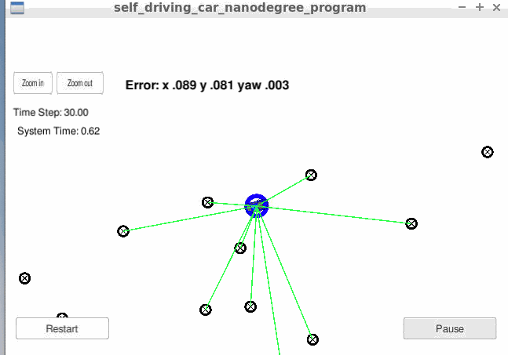
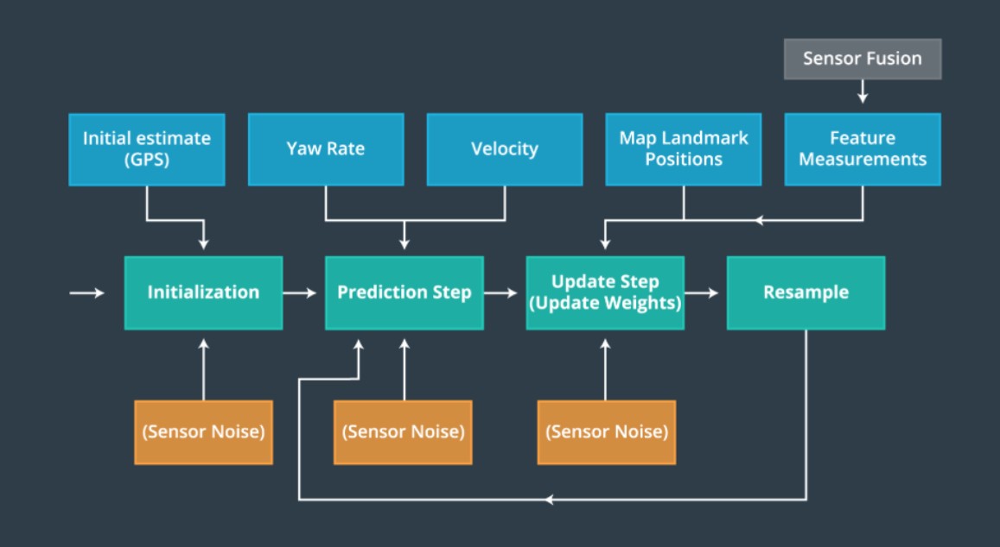

# Kidnapped Vehicle

## The Project
Implement a 2D particle filters in C++ to localize the vehicle. The [simulator](https://github.com/udacity/self-driving-car-sim/releases) for visualization is provided by Udacity.

## Result
The greens lines are the laser sensors from the car. The blue circle around the car is the car location tracked by particle filter. The error is as indicated in the below gif file.

## Scripts:
1. All scripts are in the folder "src". The Undacity repo with unmodified scripts can be found [here](https://github.com/udacity/CarND-Kidnapped-Vehicle-Project). 
2. "particle_filter.cpp" is updated with particle filter alogrithm.

|  functions | descriptions  |   
|----------|---|
|  init |   initialize N=100 particles in 2D space with Guassian noise|   
|  prediction |   update x, y, and yaw angle; add Guassian noise to the prediction|   
|  data association |  find the nearest particle id by calculating the distance of predicted measurement and observed measurement |   
|  update weights |  update the weight of particles by comparing the landmark predictions and observations using a mult-variate Gaussian distribution|   
|  resample |  resample particles according to the weights |   

## Alogrithm of particle filter

The below flow chart comes from udacity class material:

## Build and Execution

 1. ./clean.sh
 2. ./build.sh
 3. ./run.sh
 4. open simulator and press "Next" to select "Projec 3: Kidnapped Vehicle"

